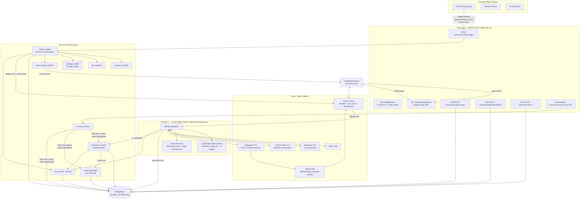
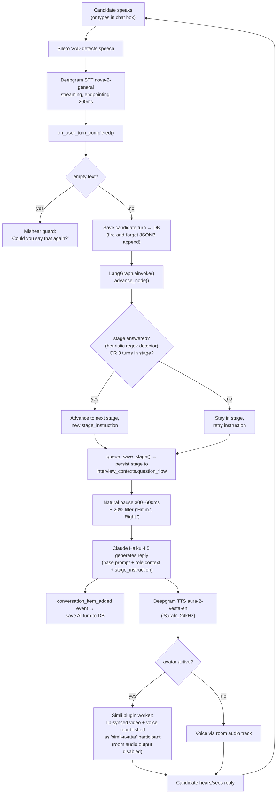
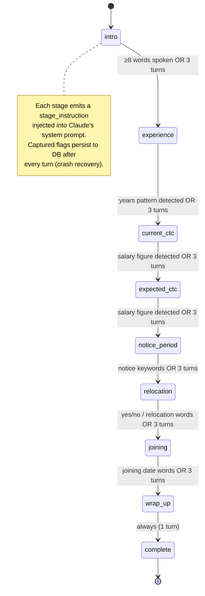
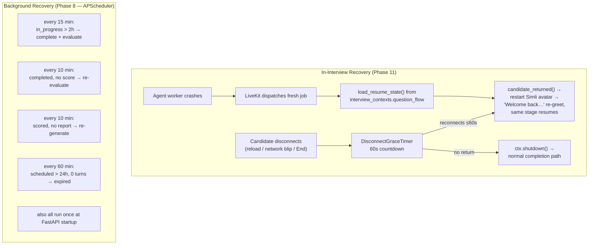
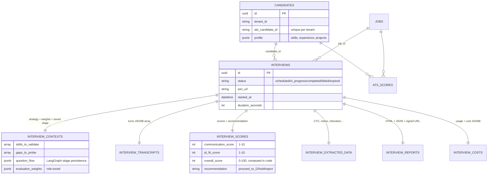

# Interview Agent — Architecture Flowcharts

> Generated from a full read-through of the codebase (no code was modified).
> Diagrams are in Mermaid — view in VS Code (Markdown Preview + Mermaid extension), GitHub, or https://mermaid.live

---

## 1. High-Level System Architecture

---

## 2. End-to-End Interview Lifecycle

```mermaid
flowchart TD
    A["ATS shortlists candidate"] --> B["POST /api/v1/interviews/trigger<br/>X-Tenant-ID + resume + ATS score + job"]
    B --> C["context_builder.build_interview_context()"]
    C --> C1["extract_resume_data()"]
    C --> C2["extract_ats_data()<br/>missing skills + risk flags"]
    C1 & C2 --> D["strategy_builder (Claude Haiku)<br/>skills_to_validate, gaps_to_probe,<br/>role-tuned evaluation weights"]
    D --> E["Upsert Candidate / Job / AtsScore<br/>Insert Interview (scheduled) + InterviewContext"]
    E --> F["Create LiveKit room<br/>interview-{id}, max 3, empty_timeout 30s"]
    F --> G["create_invite_token() — 24h JWT<br/>join_url = /interview/{id}?token=…"]
    G --> H["Email invite to candidate<br/>(skipped silently if SMTP unset)"]
    H --> I["Candidate clicks link →<br/>GET /interviews/{id}/token?token=…"]
    I -->|"valid signature + not expired"| J["LiveKit JWT issued →<br/>browser joins room (relay/TCP 443)"]
    I -->|"invalid / expired"| X1["401 Unauthorized"]
    J --> K["LiveKit dispatches agent job →<br/>entrypoint() loads context from DB"]
    K --> K1{"in_progress with<br/>saved stage?"}
    K1 -->|yes| K2["apply_resume() —<br/>'Welcome back…' re-greet"]
    K1 -->|no| K3["Fresh greeting (intro stage)"]
    K2 & K3 --> L["Start Simli avatar (optional) +<br/>AgentSession (VAD/STT/LLM/TTS)"]
    L --> M["CONVERSATION LOOP<br/>(see diagram 3)"]
    M --> N["Candidate leaves / wrap_up done"]
    N --> O["DisconnectGraceTimer — 60s"]
    O -->|"rejoins in time"| M
    O -->|"grace expires"| P["on_shutdown:<br/>status=completed, duration saved,<br/>transcript tasks drained"]
    P --> Q["run_evaluation() — Claude Haiku<br/>scores 1–10: communication, confidence,<br/>jd_fit, behavioral + extraction + recommendation"]
    Q --> R["overall (0–100) computed IN CODE<br/>with role-tuned weights<br/>(default JD 35 / Comm 25 / Behav 15 / Conf 15 / ATS 10)"]
    R --> S["Save InterviewScore +<br/>InterviewExtractedData"]
    S --> T["run_report() — no LLM call<br/>HTML + JSON report, signed 7-day report_url"]
    T --> U["Recruiter reviews:<br/>GET /evaluation · GET /report ·<br/>GET /report/html?token=…"]
    P --> V["cost_tracker.finalize_and_log()<br/>Claude + Deepgram + LiveKit + Simli + TTS → total_usd"]
```

---

## 3. Realtime Voice Turn Loop

---

## 4. LangGraph Interview State Machine

---

## 5. Crash Recovery & Durability

---

## 6. Database Schema (ER Overview)

---

## Key Facts (verified in code)

| Aspect | Value |
|---|---|
| Framework | FastAPI + livekit-agents (two separate processes) |
| Conversation LLM | `claude-haiku-4-5-20251001` (also used for strategy + evaluation) |
| STT | Deepgram `nova-2-general` (streaming, 200ms endpointing) |
| TTS | **Deepgram `aura-2-vesta-en`** ("Sarah") — code moved off ElevenLabs; some docs/pricing labels still say ElevenLabs |
| Avatar | Simli via official `livekit-plugins-simli` (separate worker); optional, graceful fallback to voice-only |
| Orchestration | LangGraph — single `advance_node`, 9 stages, heuristic detectors, max 3 turns/stage |
| Auth | X-Tenant-ID (HRMS APIs) + signed JWTs (invite 24h, report 7-day) |
| DB | PostgreSQL + SQLAlchemy 2.0 async (asyncpg), JSONB-heavy, one row per interview per table |
| Durability | 60s disconnect grace, per-turn stage persistence, 4 APScheduler recovery jobs, eval→report auto-chain |
| Cost tracking | Per-interview marginal USD across Claude / Deepgram / LiveKit / Simli / TTS in `interview_costs` |
